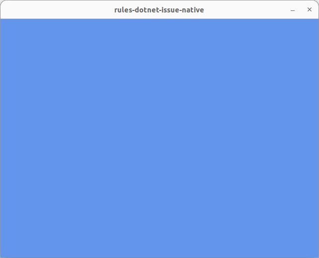

# rules-dotnet-issue-native

.NET works fine...

```bash
dotnet tool restore
dotnet paket restore
dotnet run
```



But Bazel does not...

```bash
$ bazel run //:app

Unhandled exception. System.TypeInitializationException: The type initializer for 'Sdl' threw an exception.
 ---> System.Exception: Failed to load library: libSDL2-2.0.so.0
   at MonoGame.Framework.Utilities.FuncLoader.LoadLibraryExt(String libname)
   at Sdl.GetNativeLibrary()
   at Sdl..cctor()
   --- End of inner exception stack trace ---
   at Microsoft.Xna.Framework.SdlGamePlatform..ctor(Game game)
   at Microsoft.Xna.Framework.GamePlatform.PlatformCreate(Game game)
   at Microsoft.Xna.Framework.Game..ctor()
```

The unlinked library can be found at:

`bazel-rules-dotnet-issue-native/external/nuget.monogame.framework.desktopgl.v3.8.1.303/runtimes/linux-x64/native/libSDL2-2.0.so.0`
